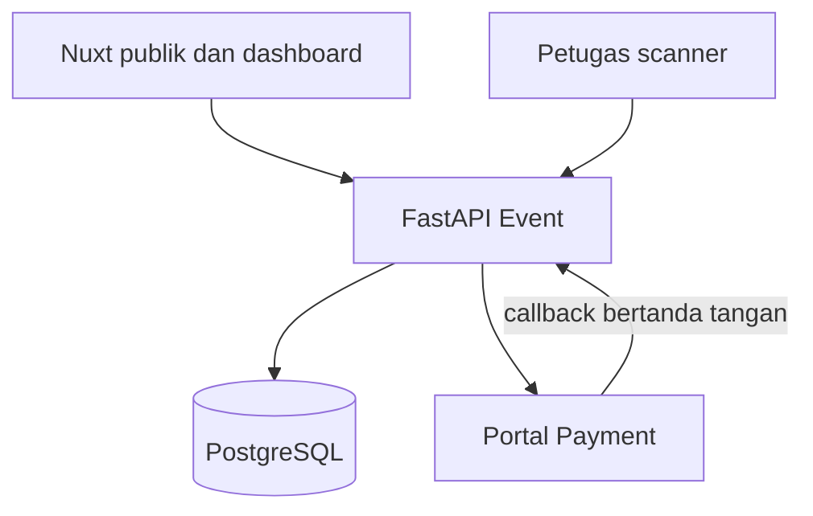

# Dokumentasi Teknis Portal Event Hari Santri 2026

**Versi:** 1.0 · **Tanggal:** 29 September 2026 · **Status:** acuan implementasi

## 1. Ringkasan dan batas sistem

Portal untuk **Sepeda Sehat dan Jalan Sehat Keluarga**, diselenggarakan **MWC NU Tarumajaya**, Minggu **25 Oktober 2026** di **Summarecon Crown Gading, Tarumajaya, Bekasi**. Jam, titik start/finish, lintasan, harga, kuota, dan daftar pengisi acara harus ditetapkan panitia di CMS; jangan mengambilnya sebagai fakta operasional dari poster ilustratif.

Stack: Nuxt 3 (TypeScript) untuk situs publik dan dashboard, FastAPI untuk API bisnis, PostgreSQL untuk data, Redis dan worker untuk antrean serta cache, object storage untuk gambar/dokumen. Konvensi waktu tampilan `Asia/Jakarta`; simpan timestamp `timestamptz` UTC. Nominal IDR sebagai integer rupiah.

Portal Event mengelola paket, peserta, pemesanan, tiket QR, check-in, konten, dan laporan operasional. **Portal Payment** mengelola checkout, DOKU/Midtrans, webhook gateway, ledger, dan rekonsiliasi. Browser tidak boleh memegang kredensial Portal Payment. Integrasi server ke server mengikuti kontrak Payment Portal yang sudah didokumentasikan; verifikasi implementasi akhir dengan layanan yang tersedia.

## 2. Peran dan ruang lingkup

| Peran | Kewenangan |
|---|---|
| Pengunjung | Membaca konten, paket, rute, agenda, hadiah; mulai pendaftaran |
| Pemesan | Mengelola akun, pesanan dan anggota keluarga, memilih ukuran kaos, membayar melalui Portal Payment, melihat tiket |
| Petugas check-in | Memindai QR, melihat identitas minimum, mencatat kehadiran sesuai hak akses |
| Admin konten | Menyunting halaman, agenda, pengisi acara, galeri, sponsor, hadiah, rute |
| Admin registrasi | Mengatur paket, kuota, koreksi registrasi, kaos, ekspor data |
| Admin keuangan | Membaca status dan ringkasan pembayaran, mencocokkan dengan Portal Payment, menangani pengecualian |
| Super admin | Pengguna, peran, konfigurasi, audit dan integrasi |

Fitur publik: beranda, tentang Hari Santri dan sejarah singkat Pertempuran 10 November (konten editorial dengan sumber), dua kegiatan, paket/harga/kuota, agenda, pengisi acara/hadir (hanya yang telah dikonfirmasi), hadiah dan mekanisme doorprize, peta dua rute, bazar kuliner/buku Islam/makanan halal, voucher dengan syarat yang jelas, FAQ, kontak, sponsor, syarat dan privasi. Pendaftaran tenant bazar adalah alur tersendiri: formulir, kategori produk, kebutuhan stan, status seleksi, biaya stan opsional melalui order terpisah jika diaktifkan.

## 3. Adaptasi dari pola IWBIF

Re-use konseptual dari portal event IWBIF: auth/profil, event dan CMS, paket/ticket type, order, peserta, tiket QR, check-in, admin dan laporan. Tambah model **anggota per pesanan**, **ukuran kaos per anggota**, **rute berjenis kegiatan**, **inventori kaos**, **tenant bazar**, **voucher**, dan **doorprize**. Lepas integrasi gateway langsung dari backend event dan gantikan dengan adapter Portal Payment. Ini peta desain, bukan klaim kesesuaian dengan repo IWBIF yang belum diperiksa; audit tabel, endpoint, dan migrasi repo tersebut sebelum porting.



## 4. Alur registrasi dan pembayaran

1. Admin menerbitkan paket `CYCLING` dan `FAMILY_WALK`, harga, kapasitas **orang** dan kapasitas **paket**, periode jual, batas usia/pendamping, isi paket, aturan kaos, dan kebijakan refund. Harga diputuskan admin, bukan frontend.
2. Pemesan login/daftar, memilih paket serta jumlah, memasukkan data tiap peserta (nama, tanggal lahir bila diperlukan, kontak wali untuk anak), ukuran kaos tiap orang, persetujuan syarat. Satu order sebaiknya satu jenis kegiatan agar tiket dan rute tidak ambigu. Bila keluarga ingin dua jenis kegiatan, buat dua order.
3. Backend memvalidasi ketersediaan paket dan stok ukuran kaos; transaksi database mengunci kapasitas lalu membuat `order` + `order_items` + `participants` + reservasi sampai `expires_at`. Snapshot harga/benefit/ukuran disimpan pada pesanan. Gunakan idempotency key untuk tombol bayar ganda.
4. Backend membuat `reference_id` unik, misalnya `HS26-REG-000123`, dan memanggil `POST /api/v1/client/payments` server ke server dengan `service_code=HARI_SANTRI_2026`, `organizer_code=MWC_NU_TARUMAJAYA`, nominal final, identitas pemesan, `expires_at`, `return_url`, metadata minimal (`event_id`, `order_id`, `package_code`). Header HMAC/nonce/idempotency mengikuti dokumen Payment Portal. Simpan `payment_id`, `payment_no`, `payment_url` dari respons. Jika panggilan timeout, cek dengan reference/idempotency sebelum mencoba membuat pembayaran lain.
5. Frontend mengarahkan ke `payment_url`. Pilihan DOKU dan Midtrans berada di Portal Payment. Redirect kembali hanya untuk tampilan; bukan bukti lunas.
6. Payment Portal memanggil endpoint callback backend Event. Verifikasi HMAC raw body, timestamp, event ID/replay, client/service/reference, amount/currency dan payment ID. Ambil order dengan lock, jalankan transisi idempotent, rekam event dan audit. Untuk `payment.paid`, ubah order `PAID`, tetapkan reservasi menjadi alokasi final, lalu terbitkan satu QR acak per peserta. Untuk `expired/failed/cancelled`, lepaskan reservasi hanya bila belum `PAID`; cegah callback terlambat menurunkan status. Respons 2xx setelah commit; kirim notifikasi via outbox/worker.
7. Job periodik mengecek pembayaran tertunda dan merekonsiliasi status melalui endpoint client Payment Portal. Jika callback `PAID` tiba setelah reservasi lepas atau kapasitas sudah habis, jangan menerbitkan tiket otomatis: tandai `PAID_NEEDS_REVIEW` dan eskalasi refund/penempatan manual. Callback refund memutakhirkan status dan validitas tiket sesuai kebijakan panitia.

Contoh payload initiate (nilai contoh, bukan harga resmi):

```json
{
  "service_code": "HARI_SANTRI_2026",
  "organizer_code": "MWC_NU_TARUMAJAYA",
  "reference_id": "HS26-REG-000123",
  "description": "Paket Jalan Sehat Keluarga Hari Santri 2026",
  "amount": 200000,
  "currency": "IDR",
  "customer": {"name": "Nama Pemesan", "email": "peserta@example.com", "phone": "+628123456789"},
  "expires_at": "2026-10-01T10:00:00Z",
  "return_url": "https://event.example.id/pembayaran/hasil",
  "metadata": {"event_id": "<uuid>", "order_id": "<uuid>", "package_code": "WALK-FAMILY"}
}
```

Callback contoh `event_type=payment.paid`, `data.reference_id=HS26-REG-000123`, `data.status=PAID`, `data.amount=200000`, `data.currency=IDR`, `data.service_code=HARI_SANTRI_2026`, `data.payment_id=<uuid>`. Format tanda tangan dan event ID harus memakai kontrak Portal Payment aktual. Jangan membuat order ID gateway di Portal Event.

## 5. Model data inti

Semua tabel memiliki `id UUID`, `created_at`, `updated_at` dan kolom audit sesuai kebutuhan. FK dan index wajib. Gunakan constraint unik dan partial index untuk mencegah duplikasi aktif.

| Tabel | Kolom penting dan aturan |
|---|---|
| `users`, `roles`, `user_roles` | email/telepon terverifikasi unik, hash password, role scoped; MFA untuk admin |
| `events` | slug unik, judul, organizer, lokasi, tanggal, timezone, status publikasi, SEO |
| `activity_types` | `CYCLING`, `FAMILY_WALK`, deskripsi, ketentuan keselamatan |
| `packages` | event_id, activity_type, code unik/event, title, unit_price, currency, capacity_orders, capacity_people, min/max participants, sales window, inclusions JSON, status |
| `shirt_sizes` | code (`KIDS_S`, `S`, `M`, `L`, `XL`, `XXL` dll), label, size chart, active, sort_order; admin menentukan daftar final |
| `shirt_inventory` | event_id, size_id, capacity, reserved, allocated; unique(event_id,size_id); cegah hasil negatif dan melebihi capacity |
| `orders` | order_no/reference_id unik, buyer_id, event_id, package_id, quantity, total_amount snapshot, status, expires_at, payment_id/payment_no/payment_url, paid_at, version |
| `order_items` | order_id, package_id, quantity, unit_price_snapshot, subtotal; mendukung perluasan tetapi v1 satu paket/order |
| `participants` | order_id, full_name, birth_date opsional, guardian_name/contact untuk anak, shirt_size_id, activity_type, ticket_id, status; snapshot ukuran pada pembayaran |
| `tickets` | participant_id unik, ticket_no unik, QR token hash unik, issued_at, status (`ACTIVE`, `USED`, `REVOKED`); QR token bukan ID berurutan |
| `checkins` | ticket_id, checkpoint_id, scanned_by, scanned_at, result; unique(ticket_id, checkpoint_id) untuk sekali per titik |
| `routes`, `route_points` | event_id, activity_type, name, description, distance_km, difficulty, route_geojson/GPX, start/finish, checkpoint, map bounds, published_at, version; satu rute published per activity per event |
| `agenda_items`, `performers`, `prizes` | jadwal publikasi dan status, foto, urutan tampil, sponsor, syarat hadiah, kuantitas; pengisi acara dapat dikaitkan ke agenda |
| `cms_pages`, `articles`, `media_assets`, `faqs`, `sponsors` | slug, status draft/published, SEO, alt text, metadata gambar dan hak pakai |
| `bazaar_applications`, `bazaar_stalls` | applicant, kategori (kuliner/buku/makanan halal/lainnya), produk, kebutuhan stan, status, keputusan dan kuota |
| `vouchers`, `voucher_redemptions` | code/QR, aturan kelayakan, tenant, masa berlaku, kuota, redemption unik; aktifkan hanya sesudah aturan bisnis disetujui |
| `payment_callback_events`, `outbox_events`, `audit_logs` | event_id unik, payload hash, status pemrosesan, waktu; perubahan terlacak |

Contoh migrasi inti ukuran kaos (sesuaikan nama tabel repo yang ada):

```sql
CREATE TABLE shirt_sizes (
  id uuid PRIMARY KEY, code varchar(24) NOT NULL UNIQUE,
  label varchar(80) NOT NULL, size_chart jsonb,
  active boolean NOT NULL DEFAULT true, sort_order integer NOT NULL DEFAULT 0
);
ALTER TABLE participants ADD COLUMN shirt_size_id uuid REFERENCES shirt_sizes(id);
CREATE INDEX ix_participants_shirt_size ON participants(shirt_size_id);
-- Backfill data peserta lama, validasi NULL, lalu pasang NOT NULL untuk event yang mewajibkan kaos.
```

Jumlah peserta keluarga dan ukuran tiap peserta harus masuk `participants`; ukuran tunggal di `orders` akan salah bila anggota keluarga berbeda ukuran. Setelah `PAID`, ubah ukuran hanya dengan izin admin, stok ukuran baru tersedia, penyesuaian stok atomik dan audit. Deadline perubahan ukuran ditetapkan panitia.

## 6. Kontrak API FastAPI

Base `/api/v1`; pagination `page`, `page_size`; response error `{ "error": { "code": "...", "message": "...", "request_id": "..." } }`. Semua write divalidasi Pydantic, otorisasi di backend, dan `Idempotency-Key` untuk create order/check-in. Endpoint di bawah adalah spesifikasi target, dapat dipetakan ke router IWBIF sesudah audit.

| Area | Endpoint | Catatan |
|---|---|---|
| Publik | `GET /events/hari-santri-2026`, `/packages`, `/routes?activity_type=...`, `/agenda`, `/performers`, `/prizes`, `/articles`, `/faqs`, `/bazaar` | Hanya konten terbit; harga/kuota diambil dari server |
| Akun | `POST /auth/register`, `/auth/login`, `/auth/refresh`, `/auth/logout`; `GET/PATCH /me` | Rate limit; refresh rotation; cookie HttpOnly bila satu origin |
| Pesanan | `POST /orders`, `GET /me/orders`, `GET /me/orders/{id}`, `POST /orders/{id}/checkout` | Pastikan buyer pemilik; checkout kembali `payment_url` |
| Peserta | `GET/PATCH /me/orders/{id}/participants/{id}`, `GET /shirt-sizes`, `GET /me/tickets`, `GET /me/tickets/{id}` | Edit dibatasi status dan deadline; ukuran kaos diperlukan |
| Callback | `POST /integrations/payment-portal/callback`, `GET /orders/{id}/payment-status` | Callback hanya S2S; status browser diturunkan dari database Event |
| Bazar | `POST /bazaar/applications`, `GET /me/bazaar/applications` | Anti-spam, upload berukuran terbatas, moderasi |
| Admin | CRUD `/admin/events`, `/admin/packages`, `/admin/shirt-sizes`, `/admin/shirt-inventory`, `/admin/routes`, `/admin/agenda`, `/admin/performers`, `/admin/prizes`, `/admin/content`, `/admin/bazaar` | RBAC, audit dan draft/publish |
| Admin registrasi | `GET /admin/orders`, `/admin/participants`, `/admin/reports/shirts`, `/admin/reports/registrations`, `/admin/reports/payments`, `POST /admin/exports` | CSV aman; filter event/paket/status; nilai pembayaran dari callback dan rekonsiliasi |
| Operasional | `POST /staff/checkins`, `GET /staff/checkins/{ticket_no}`, `GET /admin/audit-logs` | Scanner memvalidasi token di backend, bukan data QR saja |

Contoh create order:

```json
{
  "event_id": "<uuid>",
  "package_id": "<uuid>",
  "quantity": 1,
  "participants": [
    {"full_name": "Nama Peserta 1", "shirt_size_code": "M"},
    {"full_name": "Nama Peserta 2", "shirt_size_code": "KIDS_S", "guardian_name": "Nama Wali"}
  ],
  "terms_accepted": true
}
```

`quantity` berarti jumlah paket; jumlah peserta harus sesuai aturan `min/max` paket dan kapasitas per orang. Contoh `201` menghasilkan `order_id`, `reference_id`, `status=RESERVED`, `total_amount`, `expires_at`. `POST /orders/{id}/checkout` menghasilkan `payment_url`; jika portal mengembalikan pembayaran yang sama, kembalikan URL lama. Kesalahan: `409 CAPACITY_EXCEEDED`, `409 SHIRT_SIZE_OUT_OF_STOCK`, `422 INVALID_PARTICIPANT_COUNT`, `409 ORDER_EXPIRED`.

## 7. Status dan konsistensi

| Status order | Pemicu | Dampak |
|---|---|---|
| `DRAFT` | Form belum dikonfirmasi | Tanpa reservasi |
| `RESERVED` | Validasi dan reservasi berhasil | Kapasitas dan stok ukuran ditahan hingga expiry |
| `PAYMENT_PENDING` | Payment Portal menerima inisiasi | Tampilkan tautan bayar |
| `PAID` | Callback terverifikasi/rekonsiliasi | Tiket diterbitkan sekali |
| `EXPIRED`, `CANCELLED`, `FAILED` | Event valid sebelum lunas | Reservasi dilepas sekali |
| `PAID_NEEDS_REVIEW` | Lunas setelah konflik kapasitas | Tahan tiket, eskalasi manual |
| `REFUNDED` | Refund terverifikasi | Tiket dicabut sesuai aturan |

Hitung kapasitas dengan transaksi PostgreSQL dan row lock pada paket serta inventori ukuran; jangan pakai angka frontend. Worker expiry harus cek status terbaru di Portal Payment sebelum melepas reservasi jika status masih `PAYMENT_PENDING`, atau beri masa toleransi terukur. Pertahankan jejak `payment_callback_events` dan `order_status_history`. Admin tidak boleh menandai lunas hanya berdasar tangkapan layar transfer.

## 8. Nuxt 3: halaman dan implementasi

Struktur saran: `pages/index.vue`, `pages/kegiatan/[slug].vue`, `pages/rute/[activity].vue`, `pages/agenda.vue`, `pages/hadiah.vue`, `pages/bazar/index.vue`, `pages/daftar/[package].vue`, `pages/pembayaran/hasil.vue`, `pages/dashboard/{index,pesanan,tiket,profil}.vue`, `pages/admin/{index,paket,peserta,kaos,rute,agenda,konten,hadiah,bazar,laporan}.vue`, `pages/staff/scan.vue`; komponen `PackageCard`, `ParticipantForm`, `ShirtSizeSelector`, `RouteMap`, `PaymentStatus`, `TicketQR`.

- SSR untuk halaman publik; `useAsyncData`/server fetching, metadata SEO per halaman, canonical URL, Open Graph, sitemap, schema.org `Event` hanya berisi data terverifikasi.
- Dashboard memakai route middleware auth/role untuk pengalaman pengguna; API tetap memeriksa hak akses. Gunakan cookie aman HttpOnly/SameSite atau BFF bila origin berbeda; jangan taruh access token di localStorage.
- Form peserta dinamis, ukuran kaos per orang, validasi server dan client, autosave draft opsional. Tampilkan harga akhir dan expiry reservasi. Anak harus memiliki wali sesuai kebijakan panitia.
- Setelah kembali dari Payment Portal, polling terbatas `payment-status`; tampilkan `PENDING` sampai backend memverifikasi pembayaran. Beri tombol periksa ulang dan dukungan bila callback terlambat.
- Peta rute gunakan komponen client-only (misalnya Leaflet) dan GeoJSON yang dipublikasikan backend; tampilkan legenda, kilometer, start/finish, titik air/medis, aksesibilitas dan versi rute. Validasi GeoJSON dan batas wilayah saat upload admin; tampilkan fallback daftar titik bila peta gagal.
- QR tiket tidak memuat data pribadi; tampilkan tiket hanya setelah `PAID`. Screenshot QR berpotensi dibagikan sehingga scanner wajib memeriksa status online dan menolak check-in ganda.
- Responsif dan aksesibel: navigasi keyboard, kontras teks, alt foto, label input, status error terucap, ukuran sentuh nyaman. Optimasi gambar, lazy loading peta, cache konten publik.

## 9. CMS dan dashboard admin

Admin melihat KPI pesanan, peserta lunas, reservasi, kapasitas per kegiatan, distribusi ukuran kaos, check-in, status payment bermasalah, tenant bazar. Filter dan ekspor dengan identitas minimal. Editor mengatur draft, preview, publish, penjadwalan, revisi dan atribusi media. Agenda berisi waktu mulai/selesai, panggung, pembicara/pengisi acara, deskripsi. Hadiah menampilkan sponsor, jumlah, syarat klaim dan status pengumuman; mekanisme pengundian dan pencatatan pemenang harus diaudit jika fitur undian digital diaktifkan.

Laporan pembayaran Event adalah rekap berdasarkan order/paket/status dari callback dan hasil rekonsiliasi; laporan settlement dan gateway tetap bersumber dari Portal Payment. Dashboard menautkan `reference_id` dan `payment_id` agar selisih dapat ditelusuri.

## 10. Keamanan, privasi, dan operasi

Gunakan HTTPS, CORS allowlist origin resmi, rate limit auth/order/scan, CSRF untuk cookie auth, validasi upload MIME/ukuran, penyimpanan media terpisah, password hash kuat, audit perubahan, backup PostgreSQL, restore drill, secret via environment/secret manager. Pisahkan hak akses petugas dan admin. Minimalkan data anak, minta persetujuan wali, buat kebijakan retensi dan penghapusan data sesuai persyaratan penyelenggara. Rekam nomor telepon/identitas hanya bila diperlukan; jangan masukkan PII ke QR/analytics publik.

Environment utama: `DATABASE_URL`, `REDIS_URL`, `PUBLIC_SITE_URL`, `CORS_ORIGINS`, `PAYMENT_PORTAL_BASE_URL`, `PAYMENT_CLIENT_ID`, `PAYMENT_KEY_ID`, `PAYMENT_API_SECRET`, `PAYMENT_CALLBACK_SECRET`, `PAYMENT_SERVICE_CODE`, `OBJECT_STORAGE_*`. Pisahkan kredensial sandbox dan produksi. Nginx meneruskan header proxy dengan benar; jalankan migrasi Alembic dan worker outbox/expiry/reconciliation sebagai proses terpisah; health/readiness dan log dengan `request_id`.

## 11. Tahapan dan kriteria penerimaan

1. Audit repo IWBIF: inventaris router/tabel/auth/QR/check-in, pilih modul reusable, petakan migrasi tanpa menyentuh deployment aktif.
2. Buat skema event, paket, peserta, ukuran kaos, inventori, reservasi, rute, CMS; seed dua activity tanpa harga atau rute yang dikarang.
3. Implementasikan order dan integrasi Payment Portal sandbox, callback HMAC, state machine, expiry, rekonsiliasi; uji kondisi balapan dan retry.
4. Bangun Nuxt publik, pendaftaran keluarga, checkout, dashboard peserta; lalu dashboard admin, peta, bazar, check-in, laporan.
5. UAT pada pendaftaran 1 orang dan keluarga berbagai ukuran, paket berbeda, kuota/stok habis, double-click, callback ganda/terlambat, gagal bayar, pembayaran sukses saat redirect hilang, refund, QR ganda, GeoJSON invalid, akses petugas/admin.
6. Isi data final panitia, uji end-to-end sandbox lalu produksi dengan nominal uji yang disetujui; aktifkan monitoring dan backup.

**Selesai bila:** harga di server sesuai konfigurasi; satu order tidak menghasilkan pembayaran/tiket ganda; tiket hanya terbit setelah status pembayaran valid; ukuran kaos per peserta tercatat dan laporan stok cocok; masing-masing aktivitas menampilkan rute yang benar; admin dapat memutakhirkan agenda/hadiah; callback aman terhadap duplikasi; dashboard peserta dan admin menampilkan status yang konsisten.

## 12. Keputusan panitia yang perlu diisi sebelum peluncuran

Harga dan isi paket; apakah paket jalan sehat berlaku untuk satu keluarga atau per orang; rentang peserta dan aturan anak; kuota kegiatan serta stok kaos/ukuran; tenggat bayar dan ubah ukuran; GPX/GeoJSON rute yang sudah mendapat persetujuan; jam dan pengisi acara terkonfirmasi; hadiah dan syarat undian; kebijakan voucher; biaya/seleksi tenant bazar; ketentuan refund dan pembatalan; domain final, client/service code Payment Portal, serta URL callback yang terdaftar. Semua ini konfigurasi bisnis, bukan konstanta kode.
